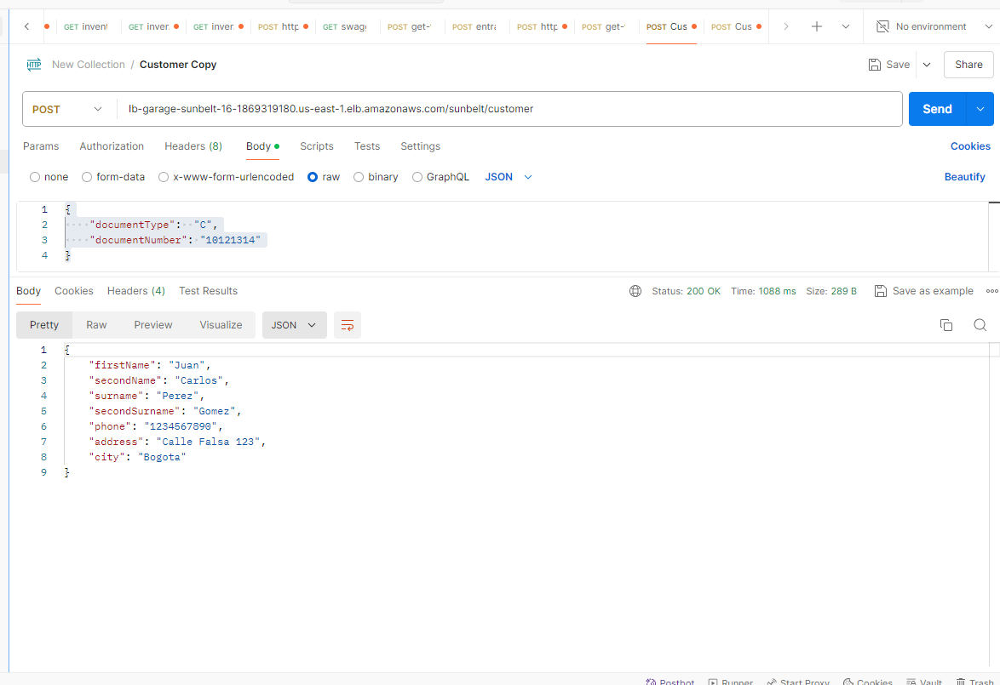

# Sunbelt

## requirements:

java 21
maven 3.9.*

## Download the Project

Clone the project repository from GitHub or download it as a ZIP file.
git clone https://github.com/JohanaForero/customer/tree/develop

## Open the Project in IntelliJ IDEA

-- Open IntelliJ IDEA.
-- Select File > New > Module from Existing Sources....
-- Navigate to the folder where you downloaded the project and select the pom.xml file.
-- Click OK to import the project.

## Download Dependencies

Once the project is open in IntelliJ IDEA: `mvn clean install`

### Execute the Project

To run the project, you must locate yourself in the main class and run the application: `mvn spring-boot:run`
Navigate to the following URL to access Swagger UI:
swagger at http://localhost:8090/swagger-ui/index.html

### Deployment on AWS

This project can be deployed on AWS using an AWS CloudFormation template. The following describes the steps to use the
template to create the necessary resources and deploy the application.
`templates.template.json`

Evidence of deployment in AWS is attached 
